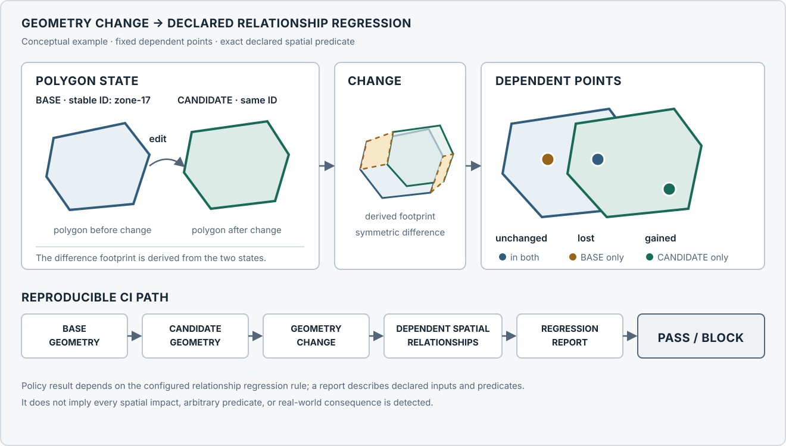

# GeoImpact CI

**Know the spatial blast radius before you merge.**

**Current stable release:** [v1.2.0 — reproducible provenance](https://github.com/soroushkarahrodi79-oss/geoimpact-ci/releases/tag/v1.2.0) · Report V5 · MIT

GeoImpact CI compares BASE and CANDIDATE polygon GeoJSON files and measures how
geometry changes alter declared spatial relationships with fixed dependent
features. It writes deterministic evidence and a PASS or BLOCK result for a CI
job. It is a first stable, reproducible research demonstrator with a deliberately
narrow contract.



_Conceptual geometry example. GeoImpact CI compares stable-ID polygon states and reports declared downstream spatial-relationship changes before merge; the result is bounded by the configured geometries, predicates, and policy._

## The question it answers

A normal validator asks, “Is this dataset valid?” GeoImpact asks, “If I merge
this spatial change, which declared downstream spatial relationships change?”
It complements geospatial validation, spatial versioning, data quality checks,
and geometry diffing; it does not replace them.

## v1 scope

GeoImpact v1 accepts Polygon or MultiPolygon BASE/CANDIDATE GeoJSON with
required stable IDs and an analysis CRS of EPSG:25830. Each stable ID is
classified as unchanged, modified, added, or removed. The deterministic change
footprint includes symmetric differences for modified IDs, the candidate
geometry for added IDs, and the base geometry for removed IDs. Maximum boundary
displacement compares only modified IDs present in both snapshots; additions
and removals have no displacement pair. Fixed dependent Point features are
compared using exact `WITHIN` predicates. An STRtree filters candidates; exact
GEOS predicates determine results. Boundary `TOUCHES` are reported separately
and never count as `WITHIN`. A configured relationship-regression policy
produces PASS or BLOCK evidence.

v1 does not support arbitrary CRSs or predicates, raster or network analysis,
database/PostGIS integration, a web UI or API, generalized change scoring,
legal or causal interpretation, or automatic administrative-intent inference.
The result describes the declared geometry and relationships; it does not
establish that source data are correct or that a real-world impact occurred.

## Quick start

Requires Python 3.11 or later. From a clean clone:

```powershell
python -m venv .venv
```

Activate the environment (`.venv\Scripts\Activate.ps1` in PowerShell, or
`source .venv/bin/activate` on Linux/macOS), then run:

```text
python -m pip install --upgrade pip
python -m pip install .
geoimpact analyze --config tests/fixtures/geoimpact.yml --out output
```

The fixture intentionally BLOCKs (exit code 1). A PASS fixture is available at
`tests/fixtures/geoimpact-pass.yml`.

## Configuration

Paths to data files are resolved relative to the YAML file. This example uses
the v1 schema:

```yaml
version: 1

analysis:
  crs: EPSG:25830

primary:
  dataset: districts
  base: base.geojson
  candidate: candidate.geojson
  id_field: district_id

dependencies:
  - dataset: facilities
    path: facilities.geojson
    id_field: facility_id
    predicate: within

policy:
  max_relationship_regressions:
    threshold: 0
    severity: block
```

The threshold is the permitted maximum number of relationship regressions; a
count above it blocks. A zero threshold is a strict example, not a universal
policy recommendation. Each stable ID must be present and unique in its input.

## Run and interpret

```text
geoimpact analyze --config PATH --out DIRECTORY
```

The command writes three files:

- `report.json` — authoritative machine-readable result.
- `report.md` — human-readable rendering of that report.
- `relationship-regressions.geojson` — spatial evidence for changed dependent
  relationships.

Exit codes are 0 for a completed PASS, 1 for a completed BLOCK, and 2 for an
operational, configuration, or input error. PASS means the configured policy
did not block the observed relationship regressions; it is not a claim that the
data are correct. BLOCK means analysis completed and the observations exceeded
the configured policy; it is not an operational failure. ERROR means no policy
verdict was produced.

## Evidence and numerical contract

The active report contract is V5. V4 added first-class stable-ID addition and
removal statuses, ID lists, and complete footprint contributions. V3 reports
remain interpretable with their earlier shared-ID-only primary change section.
V5 adds deterministic raw-byte SHA-256 identities for the config, BASE,
CANDIDATE, and dependencies, together with GeoImpact CI, Shapely/GEOS, and
PyProj/PROJ versions. It includes no local paths or timestamps; V4 reports
remain valid V4 documents. See the [V5 migration record](docs/REPORT_V5_MIGRATION.md).
GeoJSON inputs are analyzed in EPSG:25830;
the primary comparison is BASE → CANDIDATE and dependencies are fixed reference
layers. Relationship assignment uses exact GEOS `within`. `touches` is separate
boundary-ambiguity evidence. STRtree results only shortlist candidate pairs.

The derived change footprint uses a `1e-6 m` computational precision grid.
Maximum boundary displacement is measured on temporary geometry copies
conformed to its separately defined `1e-6 m` measurement grid. These grids make
derived values reproducible; they do not describe source survey accuracy.
Output ordering and report serialization are canonical under the pinned
dependencies and qualified Linux/Windows runtime matrix.

## Reproducible real-world checks

The repository includes two bounded cases, not a claim of universal coverage:

- **Madrid positive benchmark:** official INE census-section snapshots
  compared against a fixed Ayuntamiento de Madrid portal inventory. The
  reproducible subset records 2,112 assignment changes in 26 old/new section
  transition pairs (1,768 split-like and 344 merge-like patterns), with zero
  gained/lost assignments and zero boundary ambiguities. The pattern labels do
  not assert historical administrative intent or resident reassignment.
- **Sierra de Baza negative control:** protected-area boundary snapshots
  compared with a fixed REDIAM public-use equipment inventory. It records 52
  unchanged relationships, zero regressions, and zero boundary ambiguities,
  despite a maximum boundary displacement of 368.82509547712834 m. This checks
  that geometry change alone does not manufacture relationship impact.

These are source-specific research fixtures. Attribution, reuse conditions,
snapshot dates, selection recipes, and interpretation limits are recorded in
the [Madrid source register](docs/GATE_5_SOURCE_REGISTER.md) and [Sierra source
register](docs/GATE_8_SOURCE_REGISTER.md). The project does not claim ownership
or grant rights over those datasets.

## Performance qualification

On the controlled Gate 7 large synthetic relationship benchmark (300 primary
polygons and 1,500 dependents), the indexed run took 0.134966 s versus 15.420192
s for the exhaustive reference, a median 114.25× speedup and 99.667% candidate
reduction. This is a benchmark-specific observation, not a general speed claim
or runtime SLA. See [performance qualification](docs/GATE_7_PERFORMANCE.md).

## Limitations and future work

The contract is limited to the pinned Shapely/GEOS and PyProj/PROJ dependencies,
the declared input model, and the hosted Linux/Python 3.11 and Windows/Python
3.14 qualification environments. It does not establish portability across
every geometry, dependency version, CRS, or platform. Fixed dependencies do
not model simultaneous changes to those layers. Spatial membership does not
explain legal status, causality, access, service use, or socioeconomic effects.

Future work, if supported by external feedback or a specific research need,
could consider additional predicates and CRSs, GeoParquet, database
integration, a reusable multi-case verifier, broader real-world cases, package
registry publication, and a UI/API. These are outside v1.

## Development and research record

Start with the [current v1 architecture](docs/ARCHITECTURE_V1.md), [test
strategy](docs/TEST_STRATEGY.md),
[change model](docs/CHANGE_MODEL.md), and [decision log](docs/DECISION_LOG.md).
Case and qualification records: [Madrid](docs/GATE_5_REAL_WORLD_CASE.md),
[performance](docs/GATE_7_PERFORMANCE.md), [Sierra case
selection](docs/GATE_8_CASE_SELECTION.md), [Sierra interpretation and
generalization](docs/GATE_8_REAL_WORLD_GENERALIZATION.md), and
[displacement portability](docs/GATE_9_DISPLACEMENT_PORTABILITY.md). Gate
reports preserve the development history; they are supporting evidence rather
than the product contract.

## Citation and software license

If you use GeoImpact CI in research or applied work, cite the software with
[`CITATION.cff`](CITATION.cff). No DOI is currently assigned.

GeoImpact CI software is released under the [MIT License](LICENSE). Research
fixtures and third-party source data are not automatically covered by the
software license; consult [NOTICE.md](NOTICE.md) and the applicable [Madrid
source register](docs/GATE_5_SOURCE_REGISTER.md) and [Sierra source
register](docs/GATE_8_SOURCE_REGISTER.md).

## Repository map

- `src/geoimpact/` — CLI, analysis, policy, relationship, and artifact code.
- `tests/` — unit and contract tests with compact synthetic fixtures.
- `scripts/` — CI contract, benchmark, and release qualification verifiers.
- `research/` — bounded case fixtures with source notes and attribution.
- `docs/` — product, architecture, research, and validation records.

The GitHub Actions workflow runs the full suite and PASS/BLOCK/ERROR contracts,
checks canonical synthetic, Madrid, and Sierra outputs, then builds and
qualifies wheel and source-distribution installs on Linux/Python 3.11 and
Windows/Python 3.14.
